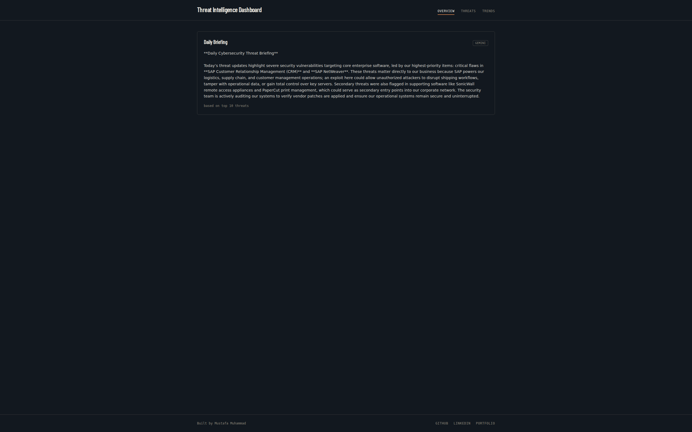
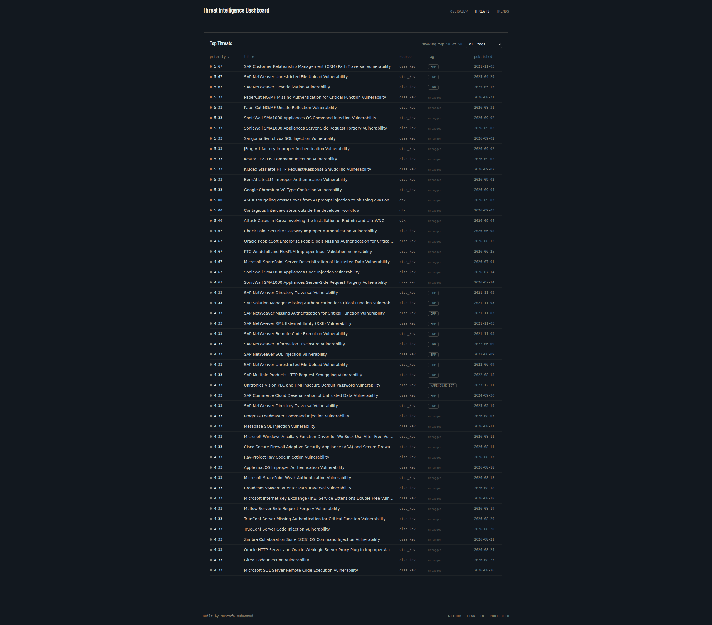
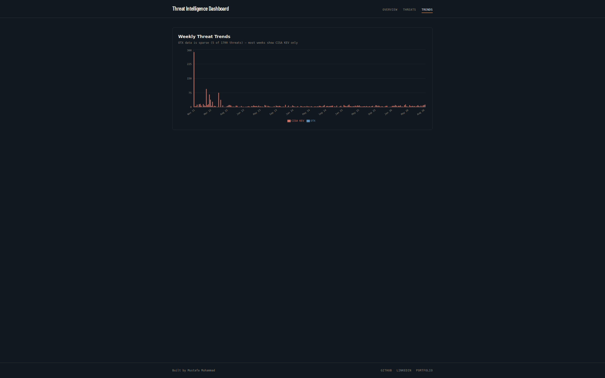

# Threat Intelligence Dashboard


Threat Intelligence Dashboard is an automated threat intelligence platform designed to monitor vulnerabilities and threat feeds affecting logistics, warehouse IoT, ERP, and critical shipping infrastructure.

The platform continuously ingests real threat telemetry from AlienVault OTX and CISA's Known Exploited Vulnerabilities (KEV) catalog, tags threats by relevance to logistics/supply-chain systems, computes a priority score per threat, tracks multi-week trends, and produces automated executive briefings via a resilient multi-tier AI fallback pipeline.

Built as a portfolio project for the Blue Team / SOC track.

## Table of Contents

- [Full Technical Report](#full-technical-report)
- [Current Status](#current-status)
- [Screenshots](#screenshots)
- [Architecture](#architecture)
- [Tech Stack](#tech-stack)
- [Project Structure](#project-structure)
- [Getting Started](#getting-started)
- [Testing](#testing)
- [API Endpoints](#api-endpoints)
- [Engineering Challenges & Lessons Learned](#engineering-challenges--lessons-learned)
- [License](#license)

---

## Full Technical Report

See [Threat-Intelligence-Dashboard-Report.docx](docs/Threat-Intelligence-Dashboard-Report.docx) for the complete write-up: problem context, architecture, engineering challenges, lessons learned, and the SafeX use-case integration.

---

## Current Status

- [x] FastAPI REST backend with SQLite persistence
- [x] Multi-source data ingestion pipeline (AlienVault OTX + CISA KEV)
- [x] Domain-specific keyword tagging (ERP, Warehouse IoT, Fleet/GPS)
- [x] Priority scoring per threat (severity, relevance, and recency sub-scores, averaged into a single 0-10 score)
- [x] Resilient 3-tier executive summary generation (`Gemini` -> `Groq` -> deterministic static template)
- [x] Historical vulnerability trend aggregation endpoint (`/trends`)
- [x] React 19 + TypeScript + Tailwind CSS dashboard
- [x] Interactive data visualization using Recharts
- [x] Multi-container Docker & Docker Compose setup (`backend` + `frontend`)

---

## Screenshots

**Overview — AI-generated daily briefing**


**Threat inventory — sortable, filterable by tag**


**Weekly threat trends**


---

## Architecture

```text
[ AlienVault OTX ]       [ CISA KEV Catalog ]
        |                         |
        +------------+------------+
                     v
         [ Ingest Pipeline Service ]
         +-- Domain Keyword Tagging
         +-- Priority Scoring (severity/relevance/recency -> 0-10)
                     v
           [ SQLite Database ]
                     v
          [ FastAPI Application ]
   +-----------------+-----------------+
   v                 v                 v
GET /threats    GET /trends       GET /summary
                                       |
                      +----------------+----------------+
                      v                                 v
              Tier 1: Google Gemini            Tier 2: Groq Llama
                      |                                 |
                      +----------------+----------------+
                                       v (on failure)
                             Tier 3: Static Template
                                       |
                                       v
                 [ React 19 / TypeScript Dashboard ]
                 +-- Live Metrics & Severity Distribution
                 +-- Historical Vulnerability Trends
                 +-- Filterable Threat Inventory
```

---

## Tech Stack

- **Backend:** Python 3.11, FastAPI, SQLAlchemy, SQLite, Uvicorn
- **Frontend:** React 19, TypeScript, Vite, Tailwind CSS, Recharts
- **AI / LLM Orchestration:** Google Gemini API, Groq API, multi-tier fallback architecture
- **Threat Intelligence Sources:** AlienVault OTX API, CISA Known Exploited Vulnerabilities (KEV) Catalog
- **Containerization:** Docker, Docker Compose, Nginx Alpine

---

## Project Structure

```text
.
├── backend/
│   ├── app/
│   │   ├── models/        # SQLAlchemy models
│   │   ├── routers/       # FastAPI route handlers (threats, trends, summary)
│   │   └── services/      # Ingest, tagging, scoring, trends, summary logic
│   ├── main.py            # FastAPI app entrypoint
│   ├── database.py        # DB engine/session setup
│   ├── check_keys.py      # Utility to verify API keys are configured
│   ├── test_*.py          # Standalone test/verification scripts (see Testing)
│   ├── requirements.txt
│   ├── .env.example
│   └── Dockerfile
├── frontend/
│   ├── src/                # React + TypeScript source
│   ├── public/
│   ├── package.json
│   └── Dockerfile
├── docs/
│   ├── screenshots/         # Dashboard screenshots used in this README
│   └── Threat-Intelligence-Dashboard-Report.docx
├── docker-compose.yml
├── LICENSE
└── README.md
```

---

## Getting Started

### Option 1: Running with Docker Compose (Recommended)

1. Ensure Docker and Docker Compose are installed.
2. Configure your environment variables in `backend/.env`:

```bash
cd backend && cp .env.example .env
# Add your OTX_API_KEY, GEMINI_API_KEY, and GROQ_API_KEY
```

3. Build and launch all services from the project root:

```bash
docker compose up --build
```

4. Access the services:
   - **Frontend Dashboard:** http://localhost:5173
   - **Backend API Docs:** http://localhost:8000/docs

### Option 2: Running Locally

**Backend Setup**

```bash
cd backend
python3 -m venv venv
source venv/bin/activate
pip install -r requirements.txt
cp .env.example .env
# Edit .env and supply your API keys
```

Run initial data ingestion:

```bash
python -m app.services.ingest
```

Start the API server:

```bash
uvicorn main:app --reload --port 8000
```

**Frontend Setup**

```bash
cd frontend
npm install
npm run dev
```

The frontend will start on http://localhost:5173.

---

## Testing

Test coverage is a set of standalone verification scripts (not a pytest suite). Run them individually from inside `backend/` with the virtual environment active:

```bash
cd backend
source venv/bin/activate
python test_scoring.py       # Verifies priority scoring across sample cases
python test_tagging.py       # Verifies domain-relevance tagging logic
python test_kev.py           # Verifies CISA KEV ingestion
python test_pull.py          # Verifies OTX pulse ingestion
python test_fallback.py      # Verifies the Gemini -> Groq -> static fallback chain
python test_ai_keys.py       # Verifies AI provider API keys are valid
python check_keys.py         # Confirms required environment variables are set
```

---

## API Endpoints

| Method | Endpoint   | Description                                                               |
| ------ | ---------- | -------------------------------------------------------------------------- |
| `GET`  | `/threats` | Returns full list of ingested threats, priority scores, and tags          |
| `GET`  | `/trends`  | Aggregates weekly historical vulnerability volume across OTX and CISA KEV |
| `GET`  | `/summary` | Produces an executive threat briefing via the 3-tier fallback chain       |
| `GET`  | `/`        | Backend health check status                                               |

---

## Engineering Challenges & Lessons Learned

1. **Cold-Start SQLite Initialization (`create_all` race condition):** Early iterations encountered 500 errors when querying `/threats` against a fresh database because models were not registered prior to creation. Registering the models and invoking `Base.metadata.create_all(bind=engine)` directly inside `main.py` ensured schema creation is guaranteed on startup.

2. **Scoped CORS vs. Browser Preflight:** Frontend queries in development hung in a `(pending)` state without browser console errors. Explicitly configuring FastAPI's `CORSMiddleware` scoped to the Vite origin resolved browser preflight rejections.

3. **Multi-Source Ingestion Resilience:** External intelligence APIs can return HTML error pages (e.g., Cloudflare 502 Bad Gateway) instead of valid JSON. Catching `requests.exceptions.RequestException` (which covers JSON decode failures) around each source individually ensures a failure in one provider (like OTX) doesn't abort ingestion for healthy sources (like CISA KEV).

4. **Sparse Historical Feeds (OTX vs. CISA KEV):** The AlienVault OTX `/pulses/subscribed` endpoint is non-historical; it only delivers pulses going forward from active subscriptions. CISA KEV, by contrast, is a cumulative catalog dating back to 2021. The trend view accounts for this split so sparse OTX weeks are not misread as data loss.

5. **Recharts X-Axis Tick Collision:** Plotting a large number of historical weeks created unreadable, overlapping timestamps. Custom tick formatters and angled tick anchors preserved visual clarity across screen widths.

---

## License

This project is licensed under the MIT License — see [LICENSE](LICENSE) for details.
